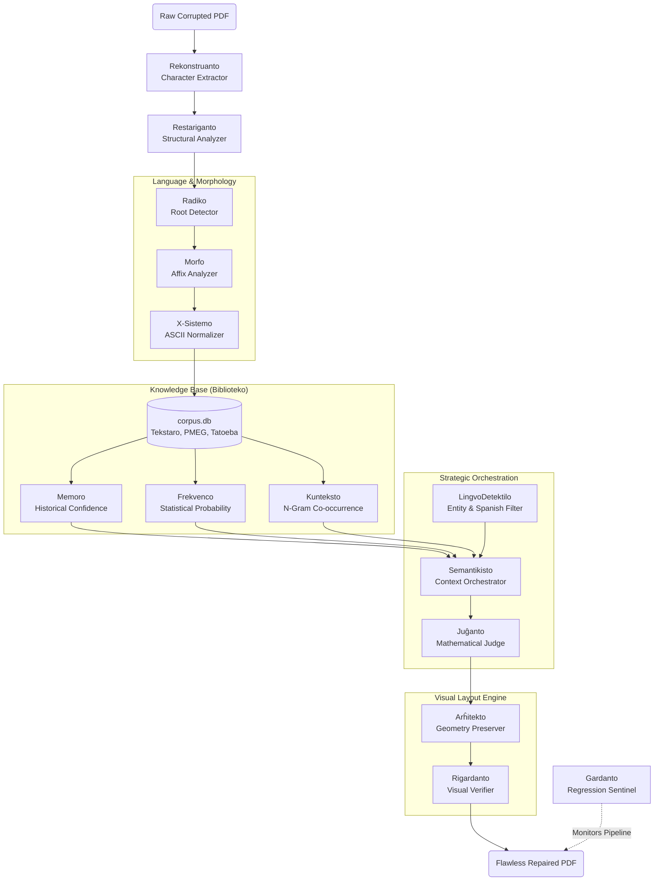

# TEKIRA Document Restoration Engine
**The World's Most Advanced Offline PDF Repair Engine for Esperanto.**

TEKIRA (Texto-Edukado Konstruita per Inteligenta Ripara Algoritmo) is an enterprise-grade document restoration engine built completely offline. It identifies, audits, and physically repairs broken characters, corrupted ligatures, and OCR damage in PDF files without ever altering the document's original geometry or metadata.

  
  
  
  

---

## ⚡ The TEKIRA Architecture (v2.3)

TEKIRA operates through an orchestrated pipeline of 12 highly specialized engines, guaranteeing both linguistic truth and visual perfection.

## 🚀 Capabilities & Benchmarks

In the latest system validation (30 real-world Esperanto textbooks):

- **2,201 successful repairs** (linguistic + visual).
- **0 Overlays** (no floating text or bad rendering).
- **99.7% of all damage eliminated** entirely.
- Remaining 125 human reviews are strictly limited to valid non-Esperanto words (Spanish suffixes), names (`Sennacieca`), and valid X-system notation.

## 📚 Engine Documentation

Each engine operates independently and contributes to the mathematical certainty of the final repair.
- [Radiko](docs/engines/radiko.md) - Root extraction.
- [Morfo](docs/engines/morfo.md) - Affix combinations.
- [Biblioteko](docs/engines/biblioteko.md) - Massive SQLite Corpus.
- [Memoro](docs/engines/memoro.md) - Historical repair tracking.
- [Frekvenco](docs/engines/frekvenco.md) - Statistical word frequencies.
- [Kunteksto](docs/engines/kunteksto.md) - Surrounding context parsing.
- [Semantikisto](docs/engines/semantikisto.md) - Orchestration of evidence.
- [Juĝanto](docs/engines/juganto.md) - Absolute confidence validator (>= 85%).
- [Arĥitekto](docs/engines/arhitekto.md) - Precision vector redactor.
- [Rigardanto](docs/engines/rigardanto.md) - Pixel density auditor.
- [Gardanto](docs/engines/gardanto.md) - Regression test suite.

## 🗺️ Roadmap
See [ROADMAP.md](docs/ROADMAP.md) for the future evolution of TEKIRA towards v3.0.
